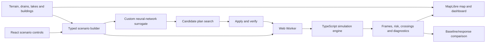

# FLOWSHIELD

> Predict the flood. Test the response. Explain the difference.

**Live application:** [flowshield-app.vercel.app](https://flowshield-app.vercel.app)

FLOWSHIELD is an interactive flood-scenario simulator and early-warning dashboard
for the Bellandur-Marathahalli area of Bengaluru. It models rainfall, terrain,
drainage, pumps, detention and movement between connected regions. Users can run
the same storm with and without a response plan, inspect Safe/Warning/Critical
conditions over time and see when individual regions first become critical.

The project was built for Hack-a-Matics 2026 under the FLOWSHIELD problem
statement and VECTOR theme.

> **Scope:** FLOWSHIELD is an exploratory scenario-comparison prototype. Its
> hydraulic capacities and risk thresholds are assumptions, and it has not been
> calibrated as an operational flood forecast.

## Why FLOWSHIELD stands out

- **Synchronized intervention comparison:** baseline and response scenarios use
  the same storm, terrain, physics and simulation clock.
- **Explainable mathematics:** water moves according to water-surface elevation,
  every transfer is conservative and every time step checks the water balance.
- **A neural network built from scratch:** a custom multilayer perceptron searches
  response plans quickly, while the full simulation engine verifies selected plans.
- **Bengaluru context:** the demo combines sampled terrain with mapped drains,
  lakes and buildings over a 78.75 km² model area.
- **Honest evidence:** 21 automated checks, numerical diagnostics, sensitivity
  controls and explicit limitations are available in the application and repository.

## Problem-statement coverage

| Hack-a-Matics requirement | FLOWSHIELD implementation |
| --- | --- |
| Configurable rainfall intensity | Steady, heavy and cloudburst schedules from 5-200 mm/hour, plus an illustrative September 2022 replay |
| Connected grid or regions | 315 cells arranged as a 21 × 15 grid with 594 four-neighbour connections |
| Water accumulation and movement | Volume-storage engine with simultaneous conservative transfers |
| Drainage and terrain | Per-cell drainage assumptions and elevation averaged from nine Copernicus GLO-90 samples per cell |
| Water levels over time | Numerical integration with saved playback frames |
| Safe / Warning / Critical | Configurable depth thresholds; defaults are 0.10 m and 0.30 m |
| Time-based visualization | Interactive Bengaluru map, playback slider, flood-progression chart and cell histories |
| Identify critical regions | Per-region risk states and full-run summaries |
| Estimated time to critical | Step-resolved first crossing, including already-critical and not-reached states |
| Bonus: normal and heavy rain | One-click presets |
| Bonus: drainage failure | Timed failure and clearing events |
| Bonus: blocked drainage channel | Simplified regional drain-opening control; not a surveyed sewer-channel model |
| Bonus: scenario comparison | Baseline/response maps, difference view and outcome metrics |
| Bonus: affected population | Not claimed; mapped buildings in critical cells are shown as an exposure proxy |
| Bonus: interactive time slider | Shared playback control across the comparison |

Additional features include drain upgrades, pump deployment, an upstream
detention approximation, AI-assisted plan search, water-balance diagnostics,
parameter sensitivity checks and an exploratory replay of September 2022 reports.

## Custom neural network

FLOWSHIELD contains a real, purpose-built neural-network surrogate. It was
implemented and trained from scratch in JavaScript without TensorFlow, PyTorch or
another machine-learning framework.

### Architecture

```text
21 engineered scenario features
          ↓
48-neuron tanh hidden layer
          ↓
48-neuron tanh hidden layer
          ↓
5 linear outputs
```

The five outputs estimate:

1. maximum water depth;
2. share of regions that become critical;
3. earliest critical time as a share of the run horizon;
4. final stored water as a share of total input; and
5. share of mapped buildings in critical regions.

The training implementation includes deterministic scenario generation, feature
and target normalization, forward propagation, backpropagation, mini-batches and
the Adam optimizer. The trained weights and normalization statistics are stored
in `src/data/surrogate-model.json` and evaluated in the browser by
[`src/app/surrogate.ts`](src/app/surrogate.ts).

### Training and evaluation

- **Dataset:** 4,000 scenarios generated by the mathematical simulation engine
- **Training split:** 3,428 scenarios
- **Held-out split:** 572 scenarios
- **Hidden layers:** 48 + 48 `tanh` units
- **Peak-depth MAE:** 5.64 cm on held-out engine runs
- **Peak-depth R²:** 0.995
- **Critical-region-share R²:** 0.995
- **Earliest-critical-time R²:** 0.958

The model can score up to 609 candidate response plans and present improving
options by unique intervention footprint. Selecting **Apply & verify** runs the
full numerical engine and compares its output with the neural-network estimate.

The surrogate learns to approximate FLOWSHIELD's engine, not measured floods.
Its errors therefore measure agreement with the simulator and are not claims of
real-world forecasting accuracy. Unsupported inputs disable AI estimates rather
than extrapolating silently.

To retrain the shipped model:

```bash
npm run train
```

This runs 4,000 engine scenarios and replaces the stored model artifact. Runtime
depends on the number of available CPU cores.

## Mathematical model

For region `i`, with area `Aᵢ`, terrain elevation `zᵢ`, stored volume `Vᵢ` and
mean water depth `hᵢ`:

```text
hᵢ = Vᵢ / Aᵢ
Hᵢ = zᵢ + hᵢ
qᵢⱼ = Gᵢⱼ (Hᵢ - Hⱼ)
```

`H` is water-surface elevation and `G` is the connection conductance. Flow
therefore depends on the water surface rather than terrain alone.

Rain adds volume. Drainage, pumping, boundary discharge and lateral transfers
request water from the same available volume. If total outgoing requests exceed
what a region contains, every request is multiplied by one donor factor:

```text
αᵢ = min(1, availableᵢ / requestedᵢ)
```

All internal transfers are calculated from the same state and applied
simultaneously. The same value is debited from the donor and credited to the
recipient, preventing negative volume, edge-order priority and double spending.

The detailed equations, event ordering, units, stability rule and limitations are
documented in [`docs/simulation-design.md`](docs/simulation-design.md). A rendered
technical report is included as
[`FLOWSHIELD_Mathematical_Report.pdf`](FLOWSHIELD_Mathematical_Report.pdf).

## System architecture



### Technology stack

| Layer | Technology |
| --- | --- |
| User interface | React 19, TypeScript, HTML and CSS |
| Build system | Vite 8 |
| Interactive mapping | MapLibre GL 6 |
| Mathematical engine | Pure TypeScript |
| Background execution | Browser Web Workers |
| Neural-network training | JavaScript/Node.js; custom MLP, backpropagation and Adam optimizer |
| Data preparation | Python 3 standard-library scripts |
| Verification | Node.js assertions and TypeScript compilation |
| Deployment | Vercel |

The event brochure suggests Python, C++ or Java with React, Streamlit or similar
tools; it does not require those exact technologies. TypeScript lets the browser,
worker and UI share one checked simulation contract without a server dependency.

## Run locally

### Prerequisites

- [Node.js](https://nodejs.org/) `20.19+` or `22.12+`
- npm, included with Node.js
- Git
- Python 3 only if rebuilding the geographic datasets

No API key, database or external backend is required for the core application.
Internet access is needed for basemap tiles and for rebuilding source data.

### 1. Clone and install

```bash
git clone https://github.com/dingdongkkk/flowshield.git
cd flowshield
npm install
```

For a clean installation matching `package-lock.json`, use `npm ci` instead of
`npm install`.

### 2. Start the development server

```bash
npm run dev
```

Open [http://localhost:5173](http://localhost:5173). Vite prints a different URL
if that port is already in use.

### 3. Try the application

1. Choose **Normal rain**, **Heavy storm** or **Drain failure** under Quick scenarios.
2. Adjust rainfall, drainage and response-plan controls if desired.
3. Leave **Re-run automatically when inputs change** enabled, or run the scenario
   manually if automatic execution is disabled.
4. Use **Baseline**, **Response** and **Difference** to inspect the same time on the map.
5. Drag the model-time slider or press Play to examine flood progression.
6. Click a map cell to inspect its depth history and first critical time.
7. Open **AI Instant estimate & plan search**, select a candidate and press
   **Apply & verify** to compare its estimate with the engine result.
8. Inspect **Early warnings**, **Response comparison**, **Water balance & numerics**
   and **How the model works** for supporting evidence.

### 4. Run verification

```bash
npm test
npm run typecheck
npm run build
```

`npm test` executes 21 engine and integration checks. `npm run build` performs a
strict TypeScript check and writes the production application to `dist/`.

### 5. Preview the production build

```bash
npm run preview
```

Open the local URL printed by Vite.

## Optional reproducibility workflows

The repository already contains the generated application datasets and trained
model, so these commands are not required to run FLOWSHIELD.

### Rebuild Bengaluru data

```bash
npm run data
```

This uses Python 3 scripts to retrieve or process public terrain, drain, lake,
building and event data. It requires internet access and can take considerably
longer than the application build. The scripts preserve provenance in the
generated manifest. No API keys are required.

### Retrain the neural network

```bash
npm run train
npm test
npm run build
```

Retraining replaces `src/data/surrogate-model.json`. Review the new held-out
metrics before committing the artifact.

## Default demonstration result

For the committed heavy-storm scenario, the baseline and response receive the
same 90 mm total rainfall over two hours and continue for one dry hour. The
response combines 3× drain capacity in 47 low cells, a detention approximation
on 189 high cells and three 0.4 m³/s pumps deployed after 30 minutes.

| Computed quantity | Baseline | Response |
| --- | ---: | ---: |
| Peak depth anywhere | 1.577 m | 1.363 m |
| Regions ever critical | 29 | 29 |
| Block H17 first critical | 31 min 43 s | 35 min 53 s |
| Final stored volume | 5,597,845 m³ | 4,744,574 m³ |

The plan lowers the maximum depth by about 21.45 cm and delays H17 by 4 minutes
10 seconds, but it does not prevent all 29 critical regions from crossing the
threshold. These are simulator outputs, not observed Bengaluru flood depths.

## Verification

The automated suite covers rainfall conversion, equal-head equilibrium,
surface-head flow direction, conservation, scarce-water sharing, event timing,
boundary discharge, validation failures, determinism, timestep refinement,
detention, drain upgrades, joint controls and AI support boundaries.

Each accepted engine step maintains two water-balance residuals and fails rather
than returning a successful partial result if configured tolerances are exceeded.
For the default run, halving the maximum step from 1.0 s to 0.5 s changes peak
depth by approximately 0.044 mm.

## Bengaluru data

| Data | Source and use |
| --- | --- |
| Elevation | Copernicus DEM GLO-90 through the [Open-Meteo Elevation API](https://open-meteo.com/en/docs/elevation-api); averaged into model cells |
| Stormwater drains | KSRSAC through [OpenCity](https://data.opencity.in/dataset/bengaluru-stormwater-drains-maps); displayed as context |
| Lakes and ponds | [OpenCity](https://data.opencity.in/dataset/lakes-and-ponds-in-bengaluru-district); displayed as context |
| Buildings | © OpenStreetMap contributors, ODbL, through Overpass; counted per model cell |
| September 2022 timing | ERA5 through the [Open-Meteo historical API](https://open-meteo.com/en/docs/historical-weather-api) |
| September 2022 reports | [The Quint, 5 September 2022](https://www.thequint.com/south-india/rains-in-bengaluru-continue-to-wreak-havoc-three-lakes-overflow-into-homes), citing IMD |
| Basemaps | CARTO, OpenFreeMap, Esri World Imagery and AWS Terrain Tiles |

Mapped drains and lakes provide geographic context. Their shapes do not define a
calibrated sewer network, drain capacities or dynamic lake storage in the engine.

## Limitations

The current model does not include momentum or flow velocity, infiltration,
soil saturation, surveyed sewer geometry, dynamic lake storage and overflow,
external catchment inflow or downstream backwater. Each 500 m cell stores one
average depth and cannot resolve individual streets. Conductance, drainage
capacity and risk thresholds are uncalibrated demonstration assumptions.

The September 2022 replay uses ERA5 timing rescaled to an illustrative total and
is not a measured local hourly rainfall record. Comparison with a small set of
reported locations is descriptive and does not establish forecast accuracy.

## Repository layout

```text
src/shared/       shared simulation contract
src/simulation/   numerical engine, validation and verification
src/app/          scenarios, worker client, comparison and AI inference
src/components/   maps, controls, charts and evidence panels
src/workers/      simulation Web Worker
src/data/         generated terrain, exposure, event and neural-network data
data/bengaluru/   reproducible geographic-data pipeline
scripts/          neural-network training and report generation
docs/             design, model-area notes and demo materials
public/           browser-served geographic layers
```

## Project authorship and AI-assistance disclosure

**Project creator, lead architect, mathematical-model owner and primary author:
Anubhav.** The product direction, system architecture, mathematical assumptions,
feature decisions, integration, evaluation standards and final responsibility for
FLOWSHIELD belong to Anubhav.

**Claude by Anthropic and OpenAI Codex** were used as AI coding assistants during
development for implementation support, review, debugging, documentation and
iteration. Their assistance is acknowledged transparently; they are development
tools and are not project owners or team members.

Open-source libraries and public datasets remain credited to their respective
authors and providers. The custom flood engine, scenario design and neural-network
training pipeline are part of the FLOWSHIELD project.

## Documentation

- [Simulation design and equations](docs/simulation-design.md)
- [Model-area decisions](docs/model-area.md)
- [Demo-video script](docs/demo-script.md)
- [Mathematical report](FLOWSHIELD_Mathematical_Report.pdf)
