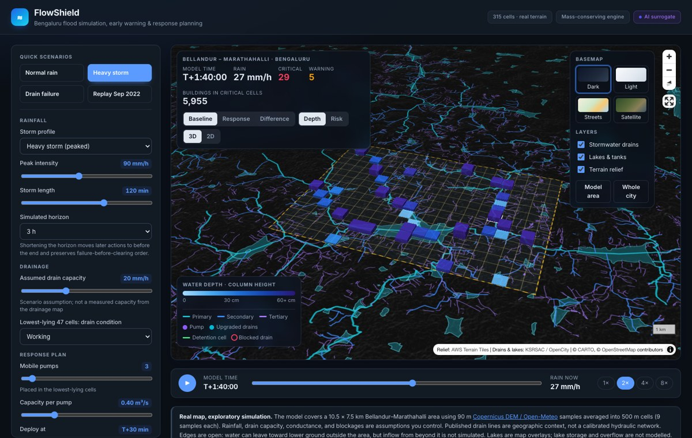
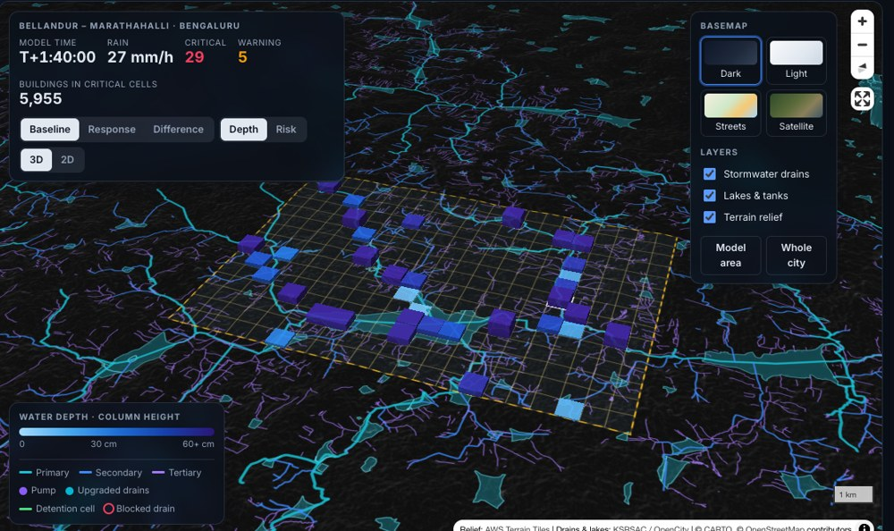
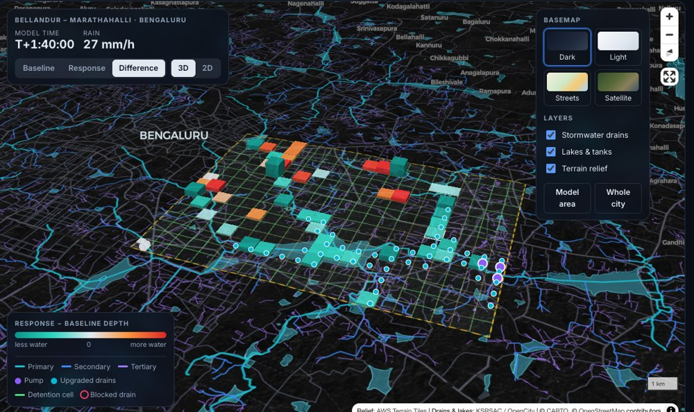
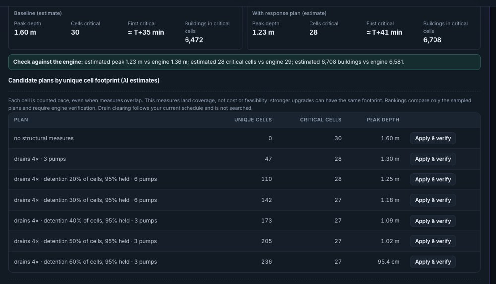
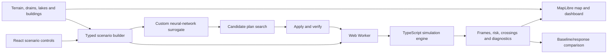

<div align="center">

# 🌊 FLOWSHIELD

### Predict the flood. Test the response. Explain the difference.

A flood-scenario simulator and early-warning dashboard for Bellandur–Marathahalli, Bengaluru —
with a **neural network written from scratch**, no ML framework.

[](https://flowshield-app.vercel.app)
[](#verification)




</div>

---

## The problem

On 5 September 2022, Bengaluru recorded its wettest September day since 2014. Bellandur,
Marathahalli and the Outer Ring Road went under water and people were evacuated by boat.
Three questions matter when that happens: **where does the water go, how much warning would
we get, and what would actually help?**

FLOWSHIELD answers all three for a 10.5 × 7.5 km slice of that area — on real terrain, over the
city's real mapped drainage network. Built for **Hack-a-Matics 2026** (problem statement
FLOWSHIELD, theme VECTOR).

> [!NOTE]
> **Scope.** FLOWSHIELD is an exploratory scenario-comparison prototype. Hydraulic capacities and
> risk thresholds are stated assumptions, and it is not calibrated as an operational flood forecast.

---

## What it does

|  |  |
| --- | --- |
| 🗺️ **Simulates on real ground** | 315 cells of 500 m, elevation averaged from nine Copernicus GLO-90 samples each, drawn over 6,839 mapped stormwater drains and 1,356 lakes |
| ⏱️ **Warns with lead time** | Every cell reports when it crosses warning and critical depth — and how many minutes sit between the two |
| 🔁 **Compares responses** | The same storm run with and without a plan: drain upgrades, upstream detention, pumps and mid-storm drain clearing |
| 🧠 **Searches plans with AI** | A hand-written neural network scores ~600 candidate plans instantly; the engine then verifies the chosen one |
| 🏙️ **Counts what's exposed** | 78,375 OpenStreetMap buildings, counted per cell, shown live as the storm plays |
| 🔬 **Shows its work** | Water balance to 10⁻⁶ m³, convergence under a halved time step, sensitivity sweeps, 21 automated checks |

<table>
<tr>
<td width="50%"><br><sub><b>Water depth</b> — columns rise with depth as the storm plays.</sub></td>
<td width="50%"><br><sub><b>Difference view</b> — teal is less water with the plan, orange is water held upstream.</sub></td>
</tr>
</table>

---

## 🧠 The neural network, built from scratch

FLOWSHIELD's AI component is **not an API call and not a library model**. The network, its
backpropagation and its Adam optimizer are written by hand in plain JavaScript — no TensorFlow,
no PyTorch, no `npm install` for the maths.

**Why it exists:** one engine run takes about half a second. That is fine for a single scenario and
far too slow to search hundreds of response plans while someone watches. The surrogate answers in
microseconds, so plan search becomes interactive.

```text
   21 engineered scenario features
   (storm shape, intensity, duration, drain state,
    pumps, detention, upgrades, event timing)
                  │
        ┌─────────▼─────────┐
        │  48 units · tanh  │   hidden layer 1
        └─────────┬─────────┘
        ┌─────────▼─────────┐
        │  48 units · tanh  │   hidden layer 2
        └─────────┬─────────┘
                  │
          5 linear outputs
   peak depth · share of cells critical · earliest
   critical time · water still stored · buildings exposed
```

**Trained on its own simulator.** The training script generates deterministic random scenarios,
runs each through the real engine across all CPU cores, then learns from the results.

| | |
| --- | ---: |
| Training scenarios (engine runs) | **3,428** |
| Held-out scenarios (never seen in training) | **572** |
| Peak-depth mean absolute error | **5.64 cm** |
| Peak-depth R² | **0.995** |
| Critical-share R² | **0.995** |
| Earliest-critical-time R² | **0.958** |
| Candidate plans scored per search | **up to 609** |

**The AI proposes; the physics decides.** Pressing **Apply & verify** loads a suggested plan and
runs the full engine on it, showing the estimate beside the true result. Every number on the map
and in the tables comes from the engine, never the network. Inputs outside the training range
disable estimates instead of silently extrapolating.

> The surrogate learns to approximate *this simulator*, not measured floods. Its error figures
> measure agreement with the engine and are not claims of real-world forecast accuracy.



Implementation: [`scripts/train-surrogate.mjs`](scripts/train-surrogate.mjs) (generation, training,
evaluation) and [`src/app/surrogate.ts`](src/app/surrogate.ts) (browser inference, range guards).
Retrain with `npm run train`.

---

## The mathematics

Each cell is a storage bucket. For region `i` with area `Aᵢ`, terrain elevation `zᵢ` and stored
volume `Vᵢ`:

```text
hᵢ = Vᵢ / Aᵢ                 mean water depth
Hᵢ = zᵢ + hᵢ                 water-surface elevation
qᵢⱼ = Gᵢⱼ (Hᵢ − Hⱼ)          transfer between neighbours, G = conductance
```

Water moves down the **water surface**, not the terrain alone, so a full low cell can push water
back uphill. Rain adds volume; drains, pumps, boundary outflow and lateral transfers all draw from
the same available water. When requests exceed what a cell holds, every request is scaled by one
donor factor:

```text
αᵢ = min(1, availableᵢ / requestedᵢ)
```

All transfers are computed from the same state and applied simultaneously, and each is debited and
credited by exactly the same amount — so no negative volumes, no edge-order priority, no double
spending. Risk follows depth: **warning at 0.10 m, critical at 0.30 m** (both configurable).

Full derivation, event ordering, units and the stability rule:
[`docs/simulation-design.md`](docs/simulation-design.md) ·
[`FLOWSHIELD_Mathematical_Report.pdf`](FLOWSHIELD_Mathematical_Report.pdf)

---

## Verification

A model you cannot check is just an animation. FLOWSHIELD ships its evidence:

- **21 automated checks** (`npm test`) — rainfall unit conversion, equal-head equilibrium, flow
  direction, conservation, scarce-water sharing, event timing, boundary discharge, validation
  failures, determinism, timestep refinement, detention, drain upgrades and AI range guards.
- **Water balance every step** — two residuals tracked; the run fails loudly rather than returning
  a partial result if tolerances are exceeded.
- **Convergence** — halving the maximum step from 1.0 s to 0.5 s moves peak depth by ~0.044 mm.
- **Sensitivity** — one click reruns the storm with conductance halved and doubled and drain
  capacity ±25%; the default storm stays at 29–31 critical cells.

### Default demonstration result

Heavy storm, 90 mm over two hours plus one dry hour. Response = 3× drain capacity in 47 low cells,
detention on 189 high cells, three 0.4 m³/s pumps at T+30 min.

| Computed quantity | Baseline | With response |
| --- | ---: | ---: |
| Peak depth anywhere | 1.577 m | **1.363 m** |
| Regions ever critical | 29 | 29 |
| Block H17 first critical | 31 min 43 s | **35 min 53 s** |
| Final stored volume | 5,597,845 m³ | **4,744,574 m³** |

The plan lowers peak depth by ~21.45 cm and delays H17 by 4 min 10 s, but does not stop all 29
cells crossing the threshold. Mobile pumps alone barely move the outcome at catchment scale —
a finding, not a bug. These are simulator outputs, not observed flood depths.

---

## Quickstart

```bash
git clone https://github.com/dingdongkkk/flowshield.git
cd flowshield
npm install
npm run dev          # http://localhost:5173
```

Requires Node.js `20.19+` or `22.12+`. No API key, database or backend. Internet is needed only for
basemap tiles.

```bash
npm test             # 21 engine and integration checks
npm run build        # strict typecheck + production build
npm run train        # retrain the neural network (~4 min on 9 cores)
npm run data         # rebuild the Bengaluru datasets (Python 3)
```

<details>
<summary><b>A two-minute tour of the app</b></summary>

1. Pick **Normal rain**, **Heavy storm**, **Drain failure** or **Replay Sep 2022** under Quick scenarios.
2. Adjust rainfall, drainage and response-plan sliders — results re-run automatically.
3. Switch **Baseline / Response / Difference** to compare the same instant on the map.
4. Drag the model-time slider or press Play to watch the flood progress.
5. Click any cell for its depth history and first critical time.
6. Open **AI Instant estimate & plan search**, choose a plan, press **Apply & verify**.
7. Read **Early warnings**, **Response comparison**, **Water balance & numerics** and
   **How the model works** for the supporting evidence.

</details>

---

## Architecture



The engine runs in a Web Worker, so a three-hour, 315-cell storm (~0.5 s) never blocks the
interface. The worker, engine and UI share one strictly typed simulation contract.

<details>
<summary><b>Technology stack and repository layout</b></summary>

| Layer | Technology |
| --- | --- |
| Interface | React 19, TypeScript, CSS |
| Build | Vite 8 |
| Mapping | MapLibre GL 6 |
| Engine | Pure TypeScript, no dependencies |
| Concurrency | Browser Web Workers |
| Neural network | JavaScript/Node.js — hand-written MLP, backpropagation, Adam |
| Data pipeline | Python 3 standard library |
| Deployment | Vercel |

```text
src/shared/       shared simulation contract
src/simulation/   numerical engine, validation and verification
src/app/          scenarios, worker client, comparison and AI inference
src/components/   maps, controls, charts and evidence panels
src/workers/      simulation Web Worker
src/data/         generated terrain, exposure, event and neural-network data
data/bengaluru/   reproducible geographic-data pipeline
scripts/          neural-network training and report generation
docs/             design, model-area notes and demo materials
public/           browser-served geographic layers
```

The brochure suggests Python, C++ or Java with React or Streamlit; it does not require them.
TypeScript lets the browser, worker and UI share one checked contract with no server.

</details>

---

## Problem-statement coverage

<details>
<summary><b>Every requirement and all seven bonus items</b></summary>

| Hack-a-Matics requirement | FLOWSHIELD implementation |
| --- | --- |
| Configurable rainfall intensity | Steady, heavy and cloudburst schedules, 5–200 mm/h, plus an illustrative September 2022 replay |
| Connected grid or regions | 315 cells in a 21 × 15 grid with 594 four-neighbour connections |
| Water accumulation and movement | Volume-storage engine with simultaneous conservative transfers |
| Drainage and terrain | Per-cell drainage assumptions; elevation averaged from nine Copernicus GLO-90 samples per cell |
| Water levels over time | Numerical integration with saved playback frames |
| Safe / Warning / Critical | Configurable depth thresholds; defaults 0.10 m and 0.30 m |
| Time-based visualisation | Interactive map, playback slider, progression chart and per-cell histories |
| Identify critical regions | Per-region risk states and full-run summaries |
| Estimated time to critical | Step-resolved first crossing, including already-critical and not-reached states |
| **Bonus** · normal and heavy rain | One-click presets |
| **Bonus** · drainage failure | Timed failure and clearing events |
| **Bonus** · blocked drainage channel | Regional drain-opening control (not a surveyed sewer-channel model) |
| **Bonus** · scenario comparison | Baseline/response maps, difference view and outcome metrics |
| **Bonus** · affected population | Not claimed — mapped buildings in critical cells shown as an exposure proxy |
| **Bonus** · interactive time slider | Shared playback control across both scenarios |

Beyond the brief: drain upgrades, pump deployment, an upstream-detention approximation,
AI-assisted plan search, water-balance diagnostics, sensitivity checks and an exploratory replay
of the September 2022 reports.

</details>

---

## Data sources

<details>
<summary><b>Every dataset, with provenance</b></summary>

| Data | Source and use |
| --- | --- |
| Elevation | Copernicus DEM GLO-90 via the [Open-Meteo Elevation API](https://open-meteo.com/en/docs/elevation-api); averaged into model cells |
| Stormwater drains | KSRSAC via [OpenCity](https://data.opencity.in/dataset/bengaluru-stormwater-drains-maps); displayed as context |
| Lakes and ponds | [OpenCity](https://data.opencity.in/dataset/lakes-and-ponds-in-bengaluru-district); displayed as context |
| Buildings | © OpenStreetMap contributors, ODbL, via Overpass; counted per model cell |
| September 2022 timing | ERA5 via the [Open-Meteo historical API](https://open-meteo.com/en/docs/historical-weather-api) |
| September 2022 reports | [The Quint, 5 September 2022](https://www.thequint.com/south-india/rains-in-bengaluru-continue-to-wreak-havoc-three-lakes-overflow-into-homes), citing IMD |
| Basemaps | CARTO, OpenFreeMap, Esri World Imagery, AWS Terrain Tiles |

Mapped drains and lakes provide geographic context. Their shapes do not define a calibrated sewer
network, drain capacities or dynamic lake storage in the engine. All services are key-free;
`npm run data` rebuilds every generated dataset and records provenance in the manifest.

</details>

---

## Limitations

No momentum or flow velocity, no infiltration or soil saturation, no surveyed sewer geometry, no
dynamic lake storage or overflow, no external catchment inflow or downstream backwater. Each 500 m
cell stores one average depth and cannot resolve individual streets. Conductance, drainage capacity
and risk thresholds are uncalibrated demonstration assumptions.

The September 2022 replay rescales ERA5 timing to an illustrative total and is not a measured local
rainfall record. Its comparison against a small set of reported locations is descriptive: it is
**not** evidence of forecast skill, and the app says so on screen.

---

## Authorship and AI-assistance disclosure

**Project creator, lead architect, mathematical-model owner and primary author: Anubhav.**
The product direction, system architecture, mathematical assumptions, feature decisions,
integration, evaluation standards and final responsibility for FLOWSHIELD are mine.

**Claude (Anthropic) and OpenAI Codex** were used as AI coding assistants for implementation
support, review, debugging, documentation and iteration. Their assistance is acknowledged openly;
they are development tools, not project owners or team members.

Open-source libraries and public datasets remain credited to their authors and providers. The
flood engine, scenario design and neural-network training pipeline are original to this project.

---

## Documentation

| Document | Contents |
| --- | --- |
| [Simulation design](docs/simulation-design.md) | Equations, event ordering, units, stability, limitations |
| [Model-area decisions](docs/model-area.md) | Why Bellandur–Marathahalli, how the grid is built |
| [Mathematical report](FLOWSHIELD_Mathematical_Report.pdf) | Rendered technical report |
| [Video script](docs/video-script.md) · [demo script](docs/demo-script.md) | Submission walkthroughs |

<div align="center">
<br>
<a href="https://flowshield-app.vercel.app"><b>▶ Open the live application</b></a>
</div>
